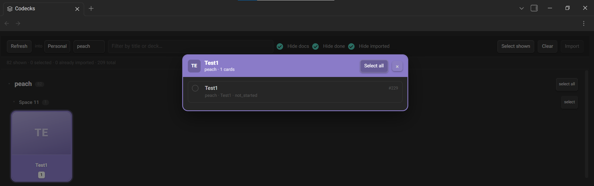

<div dir="rtl">

# پل Codecks

*[English](README.md)*

کارت‌های [Codecks](https://www.codecks.io) را داخل Obsidian ببین و آن‌هایی را که می‌خواهی به [مدیریت پروژه با زمان‌سنجی](https://github.com/milad-s5/obsidian-project-manager-with-time-tracking) بیاور — به‌شکل پروژه و تسک واقعی، تا در کانبان و داشبورد و زمان‌سنجی بنشینند بدون این‌که دوباره تایپشان کنی.

نسبت به Codecks فقط‌خواندنی است. آن‌طرف چیزی ساخته، عوض یا پاک نمی‌شود.



## چه کار می‌کند

دک‌ها همان‌طور که Codecks می‌کشدشان کشیده می‌شوند: گرید کارتی، هر کدام با رنگ خودش، نام روی نوار رنگی، و شمارنده‌ها روی لبه‌ی پایین — انتخاب‌شده، کل، و قبلاً واردشده. کلیک روی هر کارت، کارت‌های آن دک را **روی** گرید باز می‌کند نه زیرش، تا برای دیدنشان مجبور نباشی از کنار همه‌ی دک‌ها رد شوی.

کارت‌ها را می‌شود با پروژه، با متن، و با این‌که داکیومنت‌اند یا تمام‌شده یا قبلاً واردشده فیلتر کرد. هر تعداد که خواستی انتخاب کن و یک‌جا وارد کن: هر کارت یک تسک می‌شود زیر پروژه‌ای هم‌نام دکش، با شناسه‌ی Codecks مهر می‌خورد، پس وارد‌کردن دوباره‌ی همان کارت هیچ کاری نمی‌کند به‌جای این‌که تکراری بسازد.

متن هر کارت را هم می‌شود دید، ولی فقط وقتی خواستی: بدنه‌ی کارت‌ها موقع باز کردن همان دک گرفته می‌شود نه اول کار، تا لود اولیه سنگین نشود.

## راه‌اندازی

۱. [مدیریت پروژه با زمان‌سنجی](https://github.com/milad-s5/obsidian-project-manager-with-time-tracking) را نصب کن — این پلاگین از طریق API آن وارد می‌کند و اگر نباشد همین را می‌گوید.
۲. **در Codecks یک کاربر observer بساز و توکن همان حساب را بده.** پایین‌تر توضیح داده‌ام چرا.
۳. در تنظیمات، زیردامنه‌ی Codecks — همان چیزی که قبل از `.codecks.io` می‌آید — را بنویس و توکن را پیست کن.
۴. **Codecks** را از ریبون یا پنجره‌ی دستورات باز کن، انتخاب کن به کدام ورک‌اسپیس وارد شود، و Refresh بزن.

## درباره‌ی توکن

Codecks توکن API فقط‌خواندنی و محدودشده ندارد. آن توکن، توکنِ سشن است: هر کسی که داشته باشد می‌تواند جای تو بنشیند، روی همه‌ی سازمان‌هایی که عضوشان هستی، با اجازه‌ی تغییر و حذف.

پس به‌جایش از توکن یک حساب **observer** استفاده کن. observer فقط‌خواندنی است، خودِ مستندات Codecks دقیقاً همین را برای کار با API پیشنهاد می‌دهد، و این پلاگین جز خواندن کاری نمی‌کند — پس چیزی از دست نمی‌رود. لو رفتن توکن observer یعنی کسی می‌تواند بردت را ببیند، نه این‌که تصاحبش کند.

توکن کجا می‌ماند:

- در فایل خودش داخل پوشه‌ی پلاگین، **نه** در `data.json` — که در خیلی از والت‌ها به گیت کامیت می‌شود.
- فیلد تنظیمات دیگر هیچ‌وقت نشانش نمی‌دهد. ذخیره‌ی دوباره جایگزینش می‌کند و یک دکمه‌ی Clear هم هست.
- هیچ‌وقت لاگ نمی‌شود و داخل هیچ پیام خطایی نمی‌آید.

دو چیز را باید صاف بگویم. آن فایل رمزگذاری‌نشده است: روی موبایل، پلاگین به هیچ گاوصندوق سیستمی دسترسی ندارد، پس جای بهتری برای گذاشتنش نیست — و رمز کردنش با کلیدی که کنار خودش نشسته، امنیت نیست، نمایشِ امنیت است. و اگر `.obsidian/` را با چیزی جز گیت سینک می‌کنی، آن فایل را به لیست نادیده‌گرفتنِ ابزار سینکت هم اضافه کن.

این خط را به `.gitignore` والتت اضافه کن:

<div dir="ltr">

```
.obsidian/plugins/*/secret.json
```

</div>

## API کدکس چه می‌دهد و چه نمی‌دهد

این‌ها روی یک حساب واقعی کشف شده‌اند نه فرض‌شده، و اگر خواستی این پلاگین را گسترش بدهی به دردت می‌خورند:

- پاسخ‌ها نرمال‌شده‌اند: هر رابطه فقط یک id برمی‌گرداند و خود موجودیت زیر کلید نوعش می‌نشیند.
- کلید کارت `cardId` است، ولی دک و پروژه و کاربر `id` دارند.
- روی دک `projectId` می‌خواهی، `project_id` تحویل می‌گیری.
- حذف و آرشیو در `visibility` می‌نشینند — `default`، `archived` یا `deleted`. نه `deletedAt` وجود دارد نه `isArchived`؛ خواستنشان ۵۰۰ می‌دهد.
- `$limit` در هیچ شکلی پذیرفته نمی‌شود. فیلتر و `$order` کار می‌کنند.
- `assigneeId` فیلد نیست؛ `assignee` به‌شکل رابطه‌ی تودرتو جواب می‌دهد.
- دک‌ها یک `spaceId` عددی دارند، ولی هیچ مسیری به موجودیت اسپیس کار نمی‌کند، پس اسپیس نامی برای نشان‌دادن ندارد. خودت می‌توانی داخل همین پلاگین اسمشان بگذاری.
- هیچ فیلدی روی کارت آدرس قابل‌اشتراک نمی‌دهد، برای همین کارت‌ها به‌جای لینک، شماره‌شان را نشان می‌دهند.

در تنظیمات یک دکمه‌ی **Test connection** هست که کوئری‌های فقط‌خواندنی می‌زند و آنچه برگشته را در یک نوت می‌نویسد — همه‌ی موارد بالا از همین راه معلوم شده‌اند.

</div>

## حمایت

<div dir="rtl">

این پروژه رایگان ارائه شده تا همه بدون محدودیت بتوانند استفاده کنند. اگر برایت مفید بود، می‌توانی از ادامه‌ی توسعه و بهترشدنش با کمک مالی حمایت کنی.

</div>

<a href="https://www.coffeete.ir/milads55">
  
</a>
<br><br>
<a href="https://buymeabitcoffee.vercel.app/btc/bc1qwxju09p2wywqqq8udj2am8csvn6r4p4z6720q3">
  
</a>

<div dir="rtl">

## پروانه

MIT — نگاه کن به [LICENSE](LICENSE).

</div>
